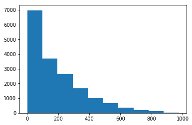

# Predicting Bike Rentals with Scikit-Learn
#### Daniel Torres - Updated 9/18/2020

#### [LinkedIn](https://www.linkedin.com/in/danielrichardtorres/) | [GitHub](https://github.com/danielrichardtorres) | [Back to Portfolio](https://danieltorres.tech)


## Introduction
### About
I completed this guided project by dataquest.io during a course on machine learning. 

I hope to demonstrate my python skills and ability to use scikit-learn to create machine learning models. In this project I will use linear regression, decision trees, and ensemble models to predict bike rentals.

### Background
Many cities have bike rental/sharing stations where you can rent bikes by the hour. Washington D.C collects information on the number of bikes people rent by hour and day. 

Hadi Fanaee-T at the University of Porto complied this data into a CSV which was provided in the guideded project. The file contains 17380 rows, with each row representing the number of bikes for a single hour of a given day.

### Goal:
Build a model to use to predict the total number of bikes rented in a given hour based off features in the dataset.

### Approach:
I will use scikit learn to build several models, using the Mean Squared Error (MSE) as the metric.  [I've learned from dataquest.io](https://app.dataquest.io/profile/deducingdaniel). I will start by:

- Importing the data
- Determining which columns are numeric and can be used as features
- Determining which column is the target column.
- Displaying the first few rows of the data to make sure it looks correct
- Move on to creating differnet models to predict the target from the features

### Results of the different models

| Model Type               	| Test 1             	| Test 2             	| Test 3             	|
|--------------------------	|--------------------	|--------------------	|--------------------	|
| Linear Regression        	| 17122 	| N/A                	| N/A                	|
| Decision Tree            	| 2684 	| 2853 	| 2722  	|
| Random Forest (ensemble) 	| 1959 	| 2742 	| 2015 	|

As you can see below, a linear model does not work well to predict this target. A nonlinear decision tree model works approximately 7 times better. In addition an ensemble model works even better.

##### Acknowledgements 
This project outline was provided by [dataquest.io](https://github.com/dataquestio/solutions) as a guided project.

# Checking Out the Data


```python
import pandas as pd
import numpy as np
```


```python
bike_rentals = pd.read_csv('bike_rental_hour.csv')
```


```python
#let's take a look at the first few rows
bike_rentals.head()
```


<div>
<style scoped>
    .dataframe tbody tr th:only-of-type {
        vertical-align: middle;
    }

    .dataframe tbody tr th {
        vertical-align: top;
    }

    .dataframe thead th {
        text-align: right;
    }
</style>
<table border="1" class="dataframe">
  <thead>
    <tr style="text-align: right;">
      <th></th>
      <th>instant</th>
      <th>dteday</th>
      <th>season</th>
      <th>yr</th>
      <th>mnth</th>
      <th>hr</th>
      <th>holiday</th>
      <th>weekday</th>
      <th>workingday</th>
      <th>weathersit</th>
      <th>temp</th>
      <th>atemp</th>
      <th>hum</th>
      <th>windspeed</th>
      <th>casual</th>
      <th>registered</th>
      <th>cnt</th>
    </tr>
  </thead>
  <tbody>
    <tr>
      <th>0</th>
      <td>1</td>
      <td>2011-01-01</td>
      <td>1</td>
      <td>0</td>
      <td>1</td>
      <td>0</td>
      <td>0</td>
      <td>6</td>
      <td>0</td>
      <td>1</td>
      <td>0.24</td>
      <td>0.2879</td>
      <td>0.81</td>
      <td>0.0</td>
      <td>3</td>
      <td>13</td>
      <td>16</td>
    </tr>
    <tr>
      <th>1</th>
      <td>2</td>
      <td>2011-01-01</td>
      <td>1</td>
      <td>0</td>
      <td>1</td>
      <td>1</td>
      <td>0</td>
      <td>6</td>
      <td>0</td>
      <td>1</td>
      <td>0.22</td>
      <td>0.2727</td>
      <td>0.80</td>
      <td>0.0</td>
      <td>8</td>
      <td>32</td>
      <td>40</td>
    </tr>
    <tr>
      <th>2</th>
      <td>3</td>
      <td>2011-01-01</td>
      <td>1</td>
      <td>0</td>
      <td>1</td>
      <td>2</td>
      <td>0</td>
      <td>6</td>
      <td>0</td>
      <td>1</td>
      <td>0.22</td>
      <td>0.2727</td>
      <td>0.80</td>
      <td>0.0</td>
      <td>5</td>
      <td>27</td>
      <td>32</td>
    </tr>
    <tr>
      <th>3</th>
      <td>4</td>
      <td>2011-01-01</td>
      <td>1</td>
      <td>0</td>
      <td>1</td>
      <td>3</td>
      <td>0</td>
      <td>6</td>
      <td>0</td>
      <td>1</td>
      <td>0.24</td>
      <td>0.2879</td>
      <td>0.75</td>
      <td>0.0</td>
      <td>3</td>
      <td>10</td>
      <td>13</td>
    </tr>
    <tr>
      <th>4</th>
      <td>5</td>
      <td>2011-01-01</td>
      <td>1</td>
      <td>0</td>
      <td>1</td>
      <td>4</td>
      <td>0</td>
      <td>6</td>
      <td>0</td>
      <td>1</td>
      <td>0.24</td>
      <td>0.2879</td>
      <td>0.75</td>
      <td>0.0</td>
      <td>0</td>
      <td>1</td>
      <td>1</td>
    </tr>
  </tbody>
</table>
</div>


```python
#get some graphing tools
%matplotlib inline
import matplotlib.pyplot as plt

#let's look at the target column distribution (the count of bike rentals)
plt.hist(bike_rentals['cnt'])
plt.show()
```


    

    


```python
#let's see what else is related to the count
bike_rentals.corr()['cnt'].sort_values(ascending=False)
```


    cnt           1.000000
    registered    0.972151
    casual        0.694564
    temp          0.404772
    atemp         0.400929
    hr            0.394071
    instant       0.278379
    yr            0.250495
    season        0.178056
    mnth          0.120638
    windspeed     0.093234
    workingday    0.030284
    weekday       0.026900
    holiday      -0.030927
    weathersit   -0.142426
    hum          -0.322911
    Name: cnt, dtype: float64


# Cleaning the Data

### Making Time Buckets
I will make a new feature column called _time label_ to help my models. 


```python
def assign_label(hour):
    if hour >=0 and hour < 6:
        return 4
    elif hour >=6 and hour < 12:
        return 1
    elif hour >= 12 and hour < 18:
        return 2
    elif hour >= 18 and hour <=24:
        return 3
    
    
bike_rentals["time_label"] = bike_rentals["hr"].apply(assign_label)
```

# Making the Differnet Models

### Error metric
Before I make a model, I need a way to evaluate prediction ability. 

The mean squared error metric makes the most sense to evaluate our error. MSE works on continuous numeric data, which fits our data quite well.


```python
train = bike_rentals.sample(frac = 0.8)
```


```python
test = bike_rentals.loc[~bike_rentals.index.isin(train.index)]
```

## Applying a Linear Regression Model


```python
from sklearn.linear_model import LinearRegression

predictors = list(train.columns)
predictors.remove('cnt')
predictors.remove('casual')
predictors.remove('dteday')
predictors.remove('registered')
```


```python
reg = LinearRegression()
reg.fit(train[predictors], train['cnt'])
```


    LinearRegression(copy_X=True, fit_intercept=True, n_jobs=None,
             normalize=False)


```python
#let's see the error of the model I just made
import numpy
predictions = reg.predict(test[predictors])
mse = numpy.mean((predictions - test['cnt'])**2)
print("Mean squared error:", mse)
```

    Mean squared error: 17122.99443724386
    

### Linear Regression Model Results
The error is fairly high. Likely due to the outliers which cause high error with this metric.

## Applying a Decision Tree Model


```python
from sklearn.tree import DecisionTreeRegressor

reg = DecisionTreeRegressor(min_samples_leaf = 5)

reg.fit(train[predictors], train['cnt'])
predictions = reg.predict(test[predictors])

mse = numpy.mean((predictions - test['cnt'])**2)
print("Mean squared error:", mse)
```

    Mean squared error: 2684.742035347036
    


```python
reg = DecisionTreeRegressor(min_samples_leaf = 2) #note the change here

reg.fit(train[predictors], train['cnt'])
predictions = reg.predict(test[predictors])

mse = numpy.mean((predictions - test['cnt'])**2)
print("Mean squared error:", mse)
```

    Mean squared error: 2928.0726569492435
    


```python
reg = DecisionTreeRegressor(min_samples_leaf = 10)

reg.fit(train[predictors], train['cnt'])
predictions = reg.predict(test[predictors])

mse = numpy.mean((predictions - test['cnt'])**2)
print("Mean squared error:", mse)
```

    Mean squared error: 2722.3022004563895
    

#### Decision Tree Results
By taking the nonlinear predictors into account the decision tree has a __much lower error than a linear regressor__

## Using an Ensemble Model

Here I will try a random forest model


```python
from sklearn.ensemble import RandomForestRegressor

reg = RandomForestRegressor(min_samples_leaf = 5, n_estimators=10)
reg.fit(train[predictors], train['cnt'])
predictions = reg.predict(test[predictors])

mse = numpy.mean((predictions - test['cnt'])**2)
print("Mean squared error:", mse)
```

    Mean squared error: 1959.052646321055
    


```python
reg = RandomForestRegressor(min_samples_leaf = 20, n_estimators=10)
reg.fit(train[predictors], train['cnt'])
predictions = reg.predict(test[predictors])

mse = numpy.mean((predictions - test['cnt'])**2)
print("Mean squared error:", mse)
```

    Mean squared error: 2853.5846115638537
    


```python
reg = RandomForestRegressor(min_samples_leaf = 5, max_depth = 20, n_estimators=10)
reg.fit(train[predictors], train['cnt'])
predictions = reg.predict(test[predictors])

mse = numpy.mean((predictions - test['cnt'])**2)
print("Mean squared error:", mse)
```

    Mean squared error: 2015.2984404143037
    

#### Ensemble Model Results

By using an ensemble of trees we got the best error yet.

However the model experienced diminishing returns. In other words we saw a much bigger jump from a linear model, to a decision tree. As compared to decision tree to ensemble.

## Final Thoughts on Predicting Bike Rentals

### Results of the different models

| Model Type               	| Test 1             	| Test 2             	| Test 3             	|
|--------------------------	|--------------------	|--------------------	|--------------------	|
| Linear Regression        	| 17122 	| N/A                	| N/A                	|
| Decision Tree            	| 2684 	| 2853 	| 2722  	|
| Random Forest (ensemble) 	| 1959 	| 2742 	| 2015 	|

### Effectiveness of Different Models and Approach
In the end I was able to use scikit-learn to make several machine learning models that were able to predict bike rentals based on time. 

The linear model was significantly worse than a decision tree model (6.8  times more error). In addition I was able to create a much better model (metric: MSE), by using an ensemble of decission trees. This ensemble is known as a random forest.

#### [LinkedIn](https://www.linkedin.com/in/danielrichardtorres/) | [GitHub](https://github.com/danielrichardtorres) | [Back to Portfolio](https://danieltorres.tech)
Dataquest Guided Project by Daniel Torres 
